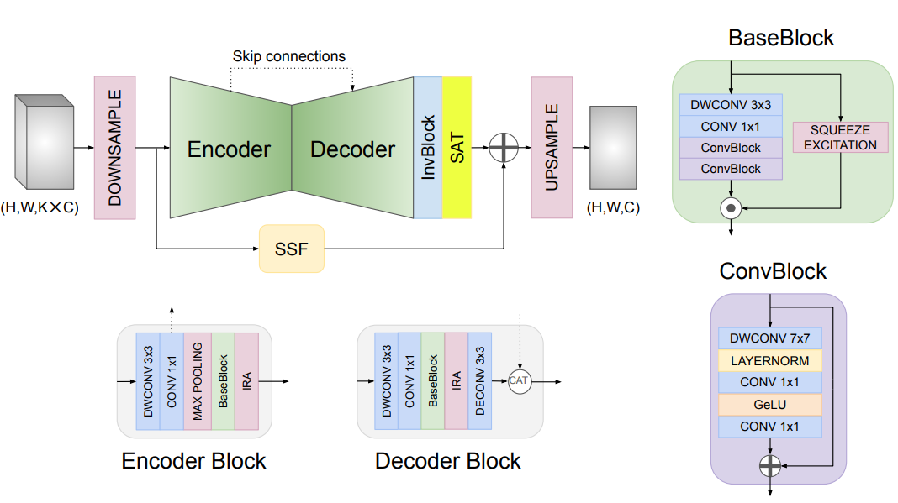
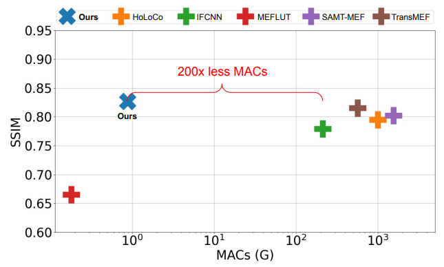
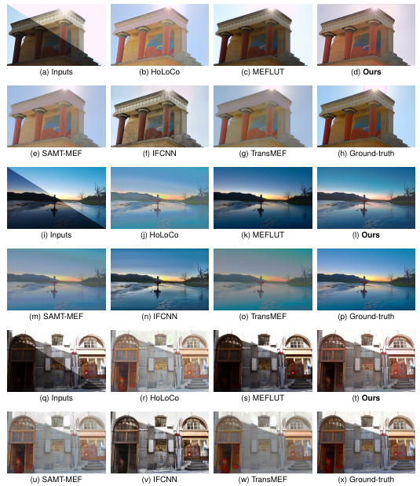

# MobileMEF
Code related to the paper "MobileMEF: Fast and Efficient Method for Multi-Exposure Fusion"

## Preview of MobileMEF

<p float="center">
  
  
</p>

## Usage

We recommend using Conda as package manager.

```
conda env create -f environment.yml
```

The ```model.py``` file provides tools for inference and converting the model to TFLITE or ONNX format.

The ```h5/``` folder provides checkpoints for the trained model in different epochs (use the 300 checkpoints to reproduce the paper results).

The ```data/``` folder provides examples of images for the input pipeline.

The ```utils/``` folder comprises auxiliary code for metrics evaluation and benchmarking with ONNX model format.

## Visual Results

<p align="center">
  
</p>

## Citation

If this work has been helpful to you, we would appreciate it if you could cite our paper! 

```
TBD
```
